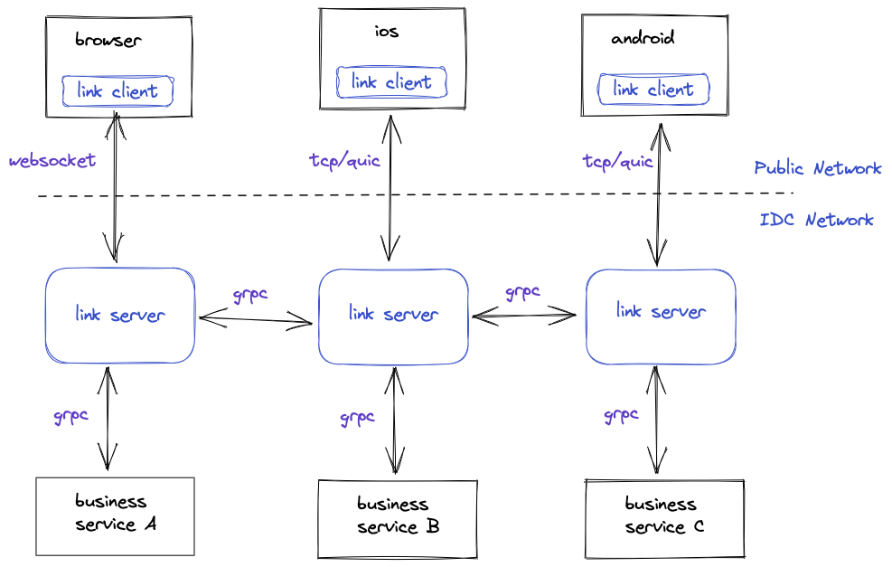

# FeatureProbe Link

FeatureProbe Link is a **generel purpose** full duplex network component to make the information flow between `Client` and `Business Service` easier.

For mobile device, FeatureProbe Link support TCP and QUIC protocols. For pure JavaScript environtment (like Browser or Electron), Websocket protocol is supported.

Apps can use `Link Client` SDK to revieve bytes from `Business Service` (usually developer's micro-service) or send bytes to `Business Service` through `Link Server`. The most common senario is Instant-Messaging Apps.

FeatureProbe use this component to make toggle update blazing fast.

## Contributing
We are working on continue evolving FeatureProbe core, making it flexible and easier to use.
Development of FeatureProbe happens in the open on GitHub, and we are grateful to the
community for contributing bugfixes and improvements.

Please read [CONTRIBUTING](https://github.com/FeatureProbe/featureprobe/blob/master/CONTRIBUTING.md)
for details on our code of conduct, and the process for taking part in improving FeatureProbe.

## License

This project is licensed under the Apache 2.0 License - see the [LICENSE](LICENSE) file for details.
